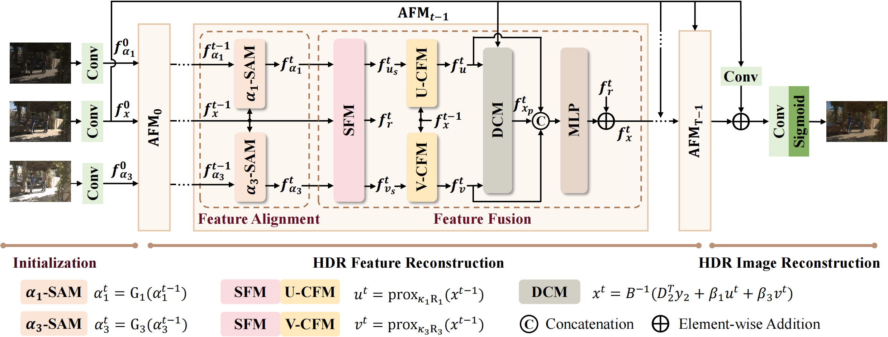

# AFUNet: Cross-Iterative Alignment-Fusion Synergy for HDR Reconstruction via Deep Unfolding Paradigm
#### International Conference on Computer Vision (ICCV), 2025

Xinyue Li<sup>1</sup>,  [Zhangkai Ni](https://eezkni.github.io/)<sup>1</sup>, [Wenhan Yang](https://flyywh.github.io/)<sup>2</sup>

<sup>1</sup>Tongji University, <sup>2</sup>Pengcheng Laboratory

This repository provides the official implementation for the paper "AFUNet: Cross-Iterative Alignment-Fusion Synergy for HDR Reconstruction via Deep Unfolding Paradigm", International Conference on Computer Vision (ICCV), 2025. [Paper-arXiv](https://arxiv.org/abs/2506.23537)





## About AFUNet

Existing learning-based methods effectively reconstruct HDR images from multi-exposure LDR inputs with extended dynamic range and improved detail, but they rely more on empirical design rather than  theoretical foundation, which can impact their reliability. To address these limitations, we propose the cross-iterative Alignment and Fusion deep Unfolding Network (AFUNet), where HDR reconstruction is systematically decoupled into two interleaved subtasks—alignment and fusion—optimized through alternating refinement, achieving synergy between the two subtasks to enhance the overall performance. Our method formulates multi-exposure HDR reconstruction from a Maximum A Posteriori (MAP) estimation perspective, explicitly incorporating spatial correspondence priors across LDR images and naturally bridging the alignment and fusion subproblems through joint constraints. Building on the mathematical foundation, we reimagine traditional iterative optimization through unfolding—transforming the conventional solution process into an end-to-end trainable AFUNet with carefully designed modules that work progressively. Specifically, each iteration of AFUNet incorporates an Alignment-Fusion Module (AFM) that alternates between a Spatial Alignment Module (SAM) for alignment and a Channel Fusion Module (CFM) for adaptive feature fusion, progressively bridging misaligned content and exposure discrepancies. Extensive qualitative and quantitative evaluations demonstrate AFUNet’s superior performance, consistently surpassing state-of-the-art methods.

**TL;DR:** We propose a novel cross-iterative Alignment and Fusion deep Unfolding network (AFUNet), achieving superior performance. It decouples HDR reconstruction into alignment and fusion subtasks, optimized through alternating refinement.


## Experimental Results

Performance comparison of various HDR reconstruction models on three widely used datasets. The performance on metrics PSNR-*&mu;*, PSNR-*l*, SSIM-*&mu;*, SSIM-*l* and HDR-VDP2 are reported. The top three performances are highlighted in red, orange, and yellow backgrounds, respectively.


### Quantitative comparisons on Kalantari’s dataset
<div align="center">  </div>


### Quantitative comparisons on Hu’s dataset
<div align="center">  </div>


### Quantitative comparisons on Tel’s dataset
<div align="center">  </div>


## Environment setup
To start, we prefer creating the environment using conda:
```sh
conda create -n afunet
conda activate afunet
pip install -r requirements.txt
```

[Pytorch](https://pytorch.org/) installation is machine dependent, please install the correct version for your machine.

<details>
  <summary> Dependencies (click to expand) </summary>

  - `PyTorch`, `numpy`: main computation.
  - `pytorch-msssim`: SSIM calculation.
  - `tqdm`: progress bar.
  - `opencv-python`,`scikit-image`: image processing.
  - `imageio`: images I/O.
  - `einops`: torch tensor shaping with pretty api.
</details>


## Getting the data

The datasets we used are as follows:

- [Kalantari's dataset](https://cseweb.ucsd.edu/~viscomp/projects/SIG17HDR/)
- [Tel's dataset](https://drive.google.com/drive/folders/1CtvUxgFRkS56do_Hea2QC7ztzglGfrlB)
- [Hu's dataset](https://github.com/nadir-zeeshan/sensor-realistic-synthetic-data)


## Directory structure for the datasets

<details>
  <summary> (click to expand;) </summary>

    data_path
    └── data
        ├── Kal
        │   ├── Training
        |   |   ├── 001
        |   |   |   ├── 262A0898.tif
        |   |   |   ├── 262A0899.tif
        |   |   |   ├── 262A0900.tif
        |   |   |   ├── exposure.txt
        |   |   |   ├── HDRImg.hdr
        |   |   ├── 002
        |   |   ...
        |   |   └── 074
        │   └── Test
        │       └── Test-set
        │           ├── 001
        |           |   ├── 262A2615.tif
        |           |   ├── 262A2616.tif
        |           |   ├── 262A2617.tif
        |           |   ├── exposure.txt
        |           |   ├── HDRImg.hdr
        |           ├── 002
        |           |   ...
        |           └── 015
        ├── Tel
        │   ├── Training
        |   |   ├── scene_0001_1
        |   |   |   ├── input_1.tif
        |   |   |   ├── input_2.tif
        |   |   |   ├── input_3.tif
        |   |   |   ├── exposure.txt
        |   |   |   ├── HDRImg.hdr
        |   |   ├── scene_0001_2
        |   |   ...
        |   |   └── scene_0052_3
        │   └── Test
        |       ├── scene_0007_1
        |       |   ├── input_1.tif
        |       |   ├── input_2.tif
        |       |   ├── input_3.tif
        |       |   ├── exposure.txt
        |       |   ├── HDRImg.hdr
        |       ├── scene_0007_2
        |       |   ...
        |       └── scene_0042_3
        └── Hu
            ├── Training
            |   ├── 001
            |   |   ├── input_1_aligned.tif
            |   |   ├── input_2_aligned.tif
            |   |   ├── input_3_aligned.tif
            |   |   ├── input_exp.txt
            |   |   ├── ref_hdr_aligned_linear.hdr
            |   ├── 002
            |   ...
            |   └── 085
            └── Test
                ├── 086
                |   ├── input_1_aligned.tif
                |   ├── input_2_aligned.tif
                |   ├── input_3_aligned.tif
                |   ├── input_exp.txt
                |   ├── ref_hdr_aligned_linear.hdr
                ├── 087
                |   ...
                └── 100

</details>


## Running the model
### Training
1. Prepare the training dataset.
2. Modify `'--dataset_dir'` in the `train.py`, which contains the `../data/Kal`, `../data/Hu` and `../data/Tel`.
3. For different datasets, modify the arguments in `train.py` as follows: 
    - For Kalantari's dataset, modify arguments in the `train.py` as follows:
      - `'--test_pat'`: `'Test/Test-set'`
      - `'--ldr_prefix`: `''`
      - `'--exposure_file_name'`: `'exposure.txt'`
      - `'--label_file_name'`: `'HDRImg.hdr'`
    - For Tel's dataset, modify arguments in the `train.py` as follows:
      - `'--test_path'`: `'Test'`
      - `'--ldr_prefix'`: `''`
      - `'--exposure_file_name'`: `'exposure.txt'`
      - `'--label_file_name'`: `'HDRImg.hdr'`
    - For Hu's dataset, modify arguments in the `train.py` as follows:
      - `'--test_path'`: `'Test'`
      - `'--ldr_prefix'`: `'input'`
      - `'--exposure_file_name'`: `'input_exp.txt'`
      - `'--label_file_name'`: `'ref_hdr_aligned_linear.hdr'`
4. Run the following commands for training:
```bash
$ python train.py
```


### Testing
1. Prepare the testing dataset.
2. Modify `'--dataset_dir'` in the `test.py`, which contains the `../data/Kal`, `../data/Hu` and `../data/Tel`.
3. For different datasets, modify the arguments in `test.py` as follows: 
    - For Kalantari's dataset, modify arguments in the `test.py` as follows:
      - `'--test_path'`: `'Test/Test-set'`
      - `'--ldr_prefix`: `''`
      - `'--exposure_file_name'`: `'exposure.txt'`
      - `'--label_file_name'`: `'HDRImg.hdr'`
    - For Tel's dataset, modify arguments in the `test.py` as follows:
      - `'--test_path'`: `'Test'`
      - `'--ldr_prefix'`: `''`
      - `'--exposure_file_name'`: `'exposure.txt'`
      - `'--label_file_name'`: `'HDRImg.hdr'`
    - For Hu's dataset, modify arguments in the `test.py` as follows:
      - `'--test_path'`: `'Test'`
      - `'--ldr_prefix'`: `'input'`
      - `'--exposure_file_name'`: `'input_exp.txt'`
      - `'--label_file_name'`: `'ref_hdr_aligned_linear.hdr'`
4. Prepare the pretrained model.
5. Modify `'--pretrained_model'`, which corresponds to the path of the pretrained model.
6. Uncomment the following line to save the predicted HDR images:
```python
# save results
# cv2.imwrite(os.path.join(args.save_dir, '00{}_pred.hdr'.format(idx)), pred_hdr)
```
7. Run the following commands for tesing:
```bash
$ python test.py
```


## Results
Pretrained models can be find in the `./pretrain_model` folder.

<!-- ## Citation
If you find our work useful, please cite it as
```
@article{ni2025ssiu,
  title={Structural Similarity-Inspired Unfolding for Lightweight Image Super-Resolution},
	author={Ni, Zhangkai, and Zhang, Yang, and Yang, Wenhan, and Wang, Hanli, and Wang, Shiqi and Kwong, Sam},
	journal={IEEE Transactions on Image Processing},
	volume={},
	pages={},
	year={2025},
	publisher={IEEE}
}
``` -->


## Acknowledgments
This code is inspired by [SCTNet](https://github.com/Zongwei97/SCTNet). We thank the authors for the nicely organized code!


## Contact
Thanks for your attention! If you have any suggestion or question, feel free to leave a message here or contact Dr. Zhangkai Ni (eezkni@gmail.com).


## License
[MIT License](https://opensource.org/licenses/MIT)
